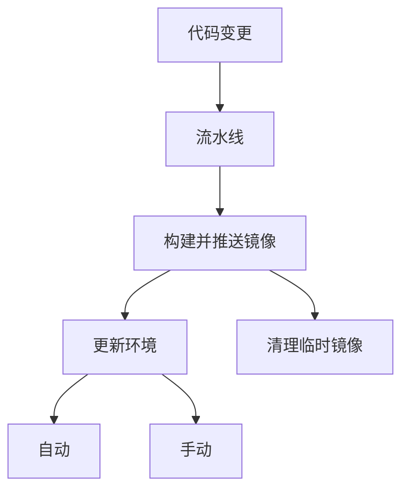

比较常见的一个场景是：



对于上面的**流水线**可以采用 [Jenkins](https://github.com/devops-ws/jenkins-learning-guide)、[Argo Workflow](https://github.com/devops-ws/argo-workflows-guide) 或者其他类似工具。至于流水线的自动触发，可以借助代码仓库的 WebHook 或者像 [Argo Events](https://argoproj.github.io/argo-events/) 这种事件驱动的框架。

可以选用 [Harbor](https://github.com/devops-ws/harbor-guide) 作为镜像仓库，它包括了：镜像同步、镜像清理、镜像代理、统一身份认证等企业级功能。当然，你需要自己想办法来确保其数据库、缓存的高可用。

最后的环境更新环节，除了可以直接登录环境操作以外，可以采用 [Argo CD](https://github.com/devops-ws/argo-cd-guide) 这种 GitOps 的方式来维护，也可以采用镜像更新控制器来实现自动更新。Argo 和 Flux 分别都提供了自己的方案：

* [Image Updater](https://github.com/argoproj-labs/argocd-image-updater)
* [Image refector and automation](https://fluxcd.io/flux/components/image/)

## Flux

下面是 Flux 提供的方案：


这里有两个组件，分别负责：[扫描镜像](https://github.com/fluxcd/image-reflector-controller)、[更新代码仓库](https://github.com/fluxcd/image-automation-controller)。

以 Kubernetes 应用为例，如果把 Deployment、ConfigMap 等清单文件与业务代码保存在同一个代码仓库中的话，需要注意避免镜像更新导致的更新**死循环**。这种情况，可以在设置 commit message 和事件触发的地方约定一个特殊字符串，下面是 `ImageUpdateAutomation` 的配置：

```yaml
apiVersion: image.toolkit.fluxcd.io/v1beta1
kind: ImageUpdateAutomation
metadata:
  name: dev-docs
  namespace: default
spec:
  interval: 3m
  sourceRef:
    kind: GitRepository
    name: dev-docs
  git:
    checkout:
      ref:
        branch: main
    commit:
      author:
        email: someone@github.com
        name: someone
      messageTemplate: 'skip-ci: {{range .Updated.Images}}{{println .}}{{end}}'
    push:
      branch: main
  update:
    path: ./kubernetes
    strategy: Setters
```

下面是 Argo Events 提供的 [Sensor](https://argoproj.github.io/argo-events/concepts/sensor/) 功能的配置：

```yaml
apiVersion: argoproj.io/v1alpha1
kind: Sensor
metadata:
  name: dev-docs-release
  namespace: default
spec:
  dependencies:
    - name: push
      eventSourceName: default
      eventName: push
      filters:
        exprLogicalOperator: "and"
        data:
          - path: body.object_kind
            type: string
            value:
              - push
          - path: body.project.name
            type: string
            value:
              - dev-docs
        exprs:
          - expr: ref =~ "refs/heads/release-" || ref == "refs/heads/main"
            fields:
              - name: ref
                path: body.ref
          - expr: msg !~ "skip-ci"
            fields:
              - name: msg
                path: commits[0].message

  triggers:
    - template:
        name: trigger
        argoWorkflow:
          operation: submit
          source:
            resource:
              apiVersion: argoproj.io/v1alpha1
              kind: Workflow
              metadata:
                generateName: dev-docs-push-
              spec:
                arguments:
                  parameters:
                    - name: branch
                workflowTemplateRef:
                  name: dev-docs
          parameters:
            - src:
                dependencyName: push
                dataKey: body.ref
              dest: spec.arguments.parameters.0.value
```

如果希望在某个环境中始终部署主干分支的版本，可以考虑以时间戳为镜像 Tag，并设置 Harbor 仅保留最近（例如：30 天）内推送的镜像。

以下是镜像更新的配置：

```yaml
apiVersion: image.toolkit.fluxcd.io/v1beta2
kind: ImagePolicy
metadata:
  name: dev-docs
  namespace: default
spec:
  imageRepositoryRef:
    name: dev-docs
  policy:
    alphabetical:
      order: asc
```

更多 DevOps 相关教程，请访问：https://github.com/devops-ws
